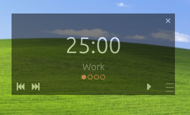

# anchor

A Pomodoro timer that stays out of your way.

Floats above your windows, semi-transparent, always visible — without demanding attention. When you need it, it's there. When you don't, it barely exists.



---

## What it does

- Counts down. Notifies you. Gets out of the way.
- Cycle counter so you always know where you are
- Sound + visual flash on phase change — no Windows toast notifications
- Remembers where you left it on screen

## What it doesn't do

No stats. No integrations. No auto-updates. No installation.  
Drop the `.exe`, run it, done.

---

## Controls

| Action | How |
|---|---|
| Play / Pause | `⏵` button (bottom right) |
| Previous / Next phase | `⏮` `⏭` buttons (bottom left) |
| Move window | Drag grip (bottom right corner) |
| Close | `✕` button (top right) |

---

## Configuration

Edit `config.toml` next to the executable. Created automatically on first run.

```toml
[global]
opacity = 0.30          # window transparency (0.0–1.0)
sound_enabled = true
volume = 0.70
window_size = "M"       # S / M / L
always_on_top = true

[profiles.classic]
work_duration_secs = 1500
short_break_secs = 300
long_break_secs = 900
cycles_before_long_break = 4

[profiles.no_long_break]
work_duration_secs = 1500
short_break_secs = 300
```

### Window sizes

| Size | Dimensions | Best for |
|---|---|---|
| S | 120 × 60 px | Large monitors, corner placement |
| M | 180 × 90 px | General use (default) |
| L | 260 × 130 px | Small monitors or reduced vision |

---

## Building from source

```sh
git clone https://github.com/youruser/anchor
cd anchor
cargo build --release
```

Requires Rust stable. Windows only.

---

## License

MIT
